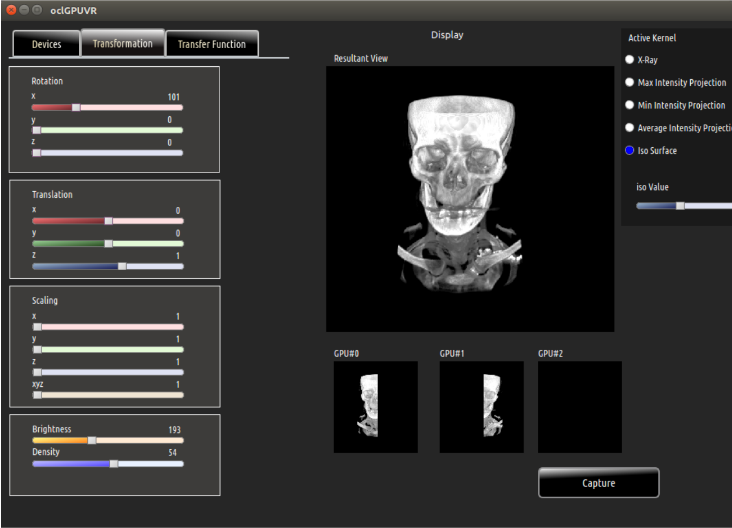

# OpenCLParallelRendering 

Parallel volume rendering framework using Open Computing Language (OpenCL), Which is heterogenous computing platform. Multi-GPU rendering is supported using sort-last rendering algorithm with automatic load balancing. 

## Requirements 

* OpenCL 
* Qt 
* OCLHWDL

## Build 


```bash
$ mkdir build
$ cd build
$ cmake .. 
$ make 
```

## UI Demo 



## Publications

* [Parallel generation of digitally reconstructed radiographs on heterogeneous multi-GPU workstations](https://www.researchgate.net/publication/309338544_Parallel_generation_of_digitally_reconstructed_radiographs_on_heterogeneous_multi-GPU_workstations)
